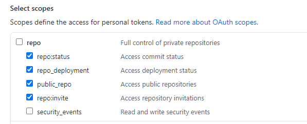
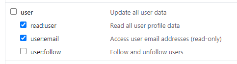

# Github-Access
Project to query the GitHub API and visualize interesting data from it.

## Getting Started

This project was created using the flask web framework along with the [pygithub](https://pygithub.readthedocs.io/en/latest/introduction.html) library for python.<br/>
To get started just clone the repository and run the github_access.py file. This will create a flask instance and generate a local host for the website that can be opened up on a web browser.

## Prerequisites
Run the code with Python 3.5+<br>
Following modules are required to run this program:

```
Flask==1.1.2
PyGithub==1.53
```

## Usage and Explanation

This website requires a valid github token for an existing account to be provided. To ensure that the required data is gathered when querying with said token make sure cetain scopes for the token are ticked off such as the following:




## Demonstration


